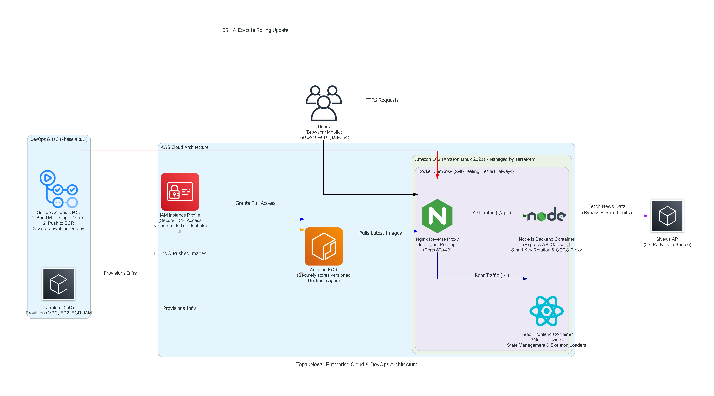

# 🌍 Top10News - Enterprise News Aggregator (Cloud-Native Architecture)

Top10News is a highly available, containerized, and fully automated full-stack news aggregator. This project showcases a complete software development lifecycle (SDLC)—from application code to enterprise-grade Cloud and DevOps deployment.

🔗 **Live Production URL:** [https://top10news.jhoja.tech](https://top10news.jhoja.tech)

---

## 🚀 Project Evolution & Architecture

This platform was engineered in 5 distinct phases, scaling from a basic local application to a robust, self-healing cloud infrastructure.

### Phase 1: Backend Architecture (Node.js & Express)
* **API Gateway Pattern:** Built an Express.js server to act as a secure proxy between the client and third-party APIs (GNews), preventing CORS issues and hiding sensitive tokens.
* **Smart Key Rotation:** Implemented dynamic API key rotation (Load Balancing logic) to bypass rate limits and ensure 99.9% uptime for news data fetching.

### Phase 2: Frontend Engineering (React & Tailwind)
* **Component-Driven UI:** Developed a fast, modular frontend using React (Vite) and Axios for asynchronous data fetching.
* **State Management:** Efficiently managed application state to handle loading, error, and success scenarios during API calls.

### Phase 3: UI/UX & Styling
* **Tailwind CSS:** Designed a fully responsive, mobile-first grid layout.
* **Perceived Performance:** Implemented "Skeleton Loaders" and smooth hover transitions to provide a premium, app-like user experience even on slower networks.

### Phase 4: Cloud Infrastructure & IaC (AWS & Terraform)
* **Infrastructure as Code:** Provisioned the entire AWS environment using **Terraform**, ensuring the infrastructure is version-controlled, repeatable, and scalable.
* **Compute & Security:** Deployed on Amazon EC2 (Amazon Linux 2023) with strictly configured Security Groups allowing traffic only on specific ports (80, 22).
* **Identity & Access Management (IAM):** Created custom IAM Roles and Instance Profiles to allow EC2 to securely pull images from ECR without hardcoding credentials.
* **Web Server & Reverse Proxy:** Configured Nginx inside Docker to intelligently route root traffic (`/`) to the React build and API traffic (`/api`) to the internal Node.js container.

### Phase 5: DevOps, Containerization & CI/CD (GitHub Actions)
* **Dockerization:** Wrote highly optimized, multi-stage `Dockerfile`s for both Frontend and Backend, reducing image sizes and ensuring environment consistency.
* **Container Registry:** Utilized AWS Elastic Container Registry (ECR) for securely storing and versioning Docker images.
* **Automated CI/CD Pipeline:** Built a zero-touch deployment workflow using **GitHub Actions**.
  * **Build:** Triggers on `git push` to `main`.
  * **Push:** Authenticates with AWS via GitHub Secrets, builds Docker images, and pushes them to AWS ECR.
  * **Deploy:** Securely SSHs into the EC2 instance, dynamically generates `docker-compose.yml`, pulls the latest images, and performs a rolling update of containers without downtime.
* **Self-Healing:** Configured Docker Compose with `restart: always` policies to automatically recover containers upon server reboots or unexpected crashes.

---

## 🛠️ Technology Stack Breakdown

| Category | Technologies Used |
| :--- | :--- |
| **Cloud Provider** | Amazon Web Services (EC2, ECR, IAM) |
| **Infrastructure as Code** | Terraform |
| **CI/CD Pipeline** | GitHub Actions |
| **Containerization** | Docker, Docker Compose |
| **Reverse Proxy** | Nginx |
| **Backend Framework** | Node.js, Express.js |
| **Frontend Framework** | React.js (Vite), Tailwind CSS |

---

## 🔒 Security Practices Implemented
1. **Secrets Management:** Sensitive AWS credentials and API keys are strictly managed via GitHub Action Secrets and `.env` files.
2. **Ignored Artifacts:** Hardened `.gitignore` prevents `.pem` keys, `.tfstate` files, and `.env` variables from ever being committed to version control.
3. **Principle of Least Privilege:** AWS IAM roles restrict EC2 instance permissions to ECR read-only access.

---

## 🤝 Author
**Mohd Aatif Jhoja** Passionate about Full-Stack Development, Cloud Infrastructure, and DevOps Automation.
* GitHub: [@iamaatifjhoja0123](https://github.com/iamaatifjhoja0123)
